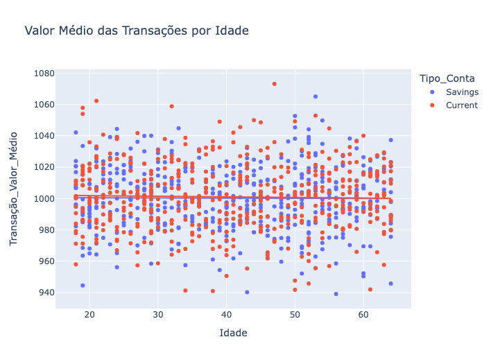

# AnomalyDetector
Modelo de detecção de anomalias em transações financeiras utilizando Python e algoritmo 'Isolation Forest'.

## Recursos

- Uso do algoritmo 'Isolation Forest' para identificar anomalias em dados. 
- Análise exploratória dos dados para identificar padrões e irregularidades.
- Detecção de anomalias como o modelo detector.
- Visualizações das informações obtidas.

## Demonstração
Nesse exemplo é criado um Scatter plot que verifica a relação de causa e efeito entre o valor médio de transação e idade do titular da conta.




Ao usar o modelo detector, o usuário insere os valores nos campos específicos, e a previsão é feita com base nos dados colhidos durante o treinamento.

```
Insira o valor para 'Transação_Valor': 10000
Insira o valor para 'Transação_Valor_Médio': 900
Insira o valor para 'Frequência': 6
```

```
<!-- Saída:  -->

Anomalia detectada: Essa transação está sinalizada como fraudulenta (anomalia).
```

